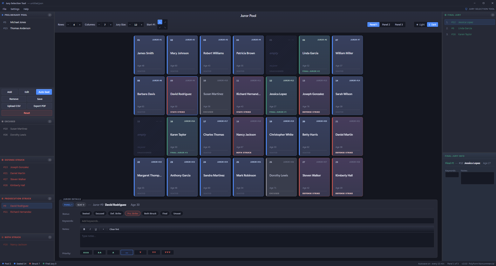

# Jury Selection Tool

A free, open-source desktop application for organizing juror notes and tracking seat assignments during jury selection.



---

## Features

- **Drag-and-drop seating** — drag jurors from the pool onto a configurable seat grid
- **Multi-panel support** — manage multiple independent jury panels with a single click
- **Rich-text notes** — per-juror notes with bold, italic, and underline formatting
- **Status tracking** — Seated, Excused, Defense Strike, Prosecution Strike, Both Struck, Final Jury
- **Final jury tracker** — mark and order final jurors and alternates
- **Priority ratings** — ▲▲▲ to ▼▼▼ priority flags per juror
- **PDF export** — formatted report of all panels, seat assignments, and juror details
- **CSV import** — bulk-add jurors from a spreadsheet
- **Autosave** — automatically saves at a configurable interval
- **Light and dark themes**
- **Resizable columns** — drag the sidebar dividers; save preferred widths as default
- **Keyboard shortcuts** — `Ctrl+S` save, `Ctrl+O` open, `Ctrl+,` preferences, `F1` help

---

## Installation (Windows)

1. Go to the [**Releases**](https://github.com/hubcap12/Jury-Selection-Tool/releases) page
2. Download **`JuryTool_v2_Setup.exe`** from the latest release
3. Run the installer and follow the prompts
4. Launch **Jury Selection Tool** from the Start Menu or desktop shortcut

No Python installation required — the app is fully self-contained.

---

## Running from Source

Requires Python 3.10+ and the dependencies below:

```bash
git clone https://github.com/hubcap12/Jury-Selection-Tool.git
cd Jury-Selection-Tool
pip install pywebview[qt] PySide6 reportlab
python jury_v2.py
```

---

## Saving and Loading

- **Save / Open**: `Ctrl+S` / `Ctrl+O` — saves as a `.json` file you can reopen later
- **Autosave**: Saves snapshots to your working directory at a configurable interval (Preferences → Autosave)
- **Export PDF**: File → Export PDF, or via the action buttons in the left sidebar

---

## Transparency / Security

This application is fully open source. All source files are available in this repository so anyone can inspect exactly what the program does before installing it. No data is ever sent over the internet — everything is stored locally on your machine.

---

## License

[PolyForm Noncommercial License 1.0.0](LICENSE) — free to use, modify, and distribute for non-commercial purposes. Commercial use is not permitted.

---

## Previous version (v1 — Tkinter UI)

The original Tkinter-based desktop UI is still available in this repository as `jury.py`. It has no additional dependencies beyond `reportlab` and `Pillow`, and runs on any platform with Python 3.10+.

```bash
pip install reportlab pillow
python jury.py
```

Releases prior to v2.0.0 ship the Tkinter version as `JuryTool_Setup.exe`. If you need the old interface for any reason, download a pre-v2 release from the [Releases](https://github.com/hubcap12/Jury-Selection-Tool/releases) page.
